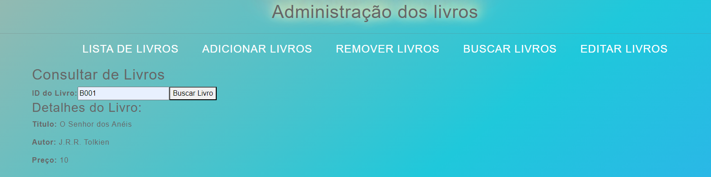
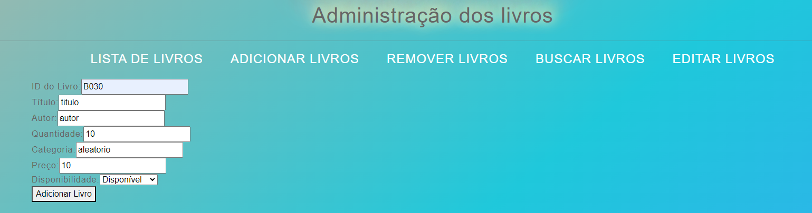
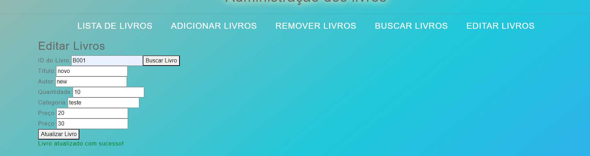

# Library_UI

* Library example to web-2, this module is started with library_api

* This module allows the user: 
    * Find books

    * Add books

    * Delete books

    * Update books

# Routes to ui:
* http://localhost:3000/
* http://localhost:3000/add
* http://localhost:3000/find
* http://localhost:3000/edit
* http://localhost:3000/delete

# Start project:
* after project clone: cd library_ui
* yarn install
* yarn start

# Build project:
* docker build -f Dockerfile -t librari_ui:1.0 .
* docker run -p 80:80 librari_ui:1.0